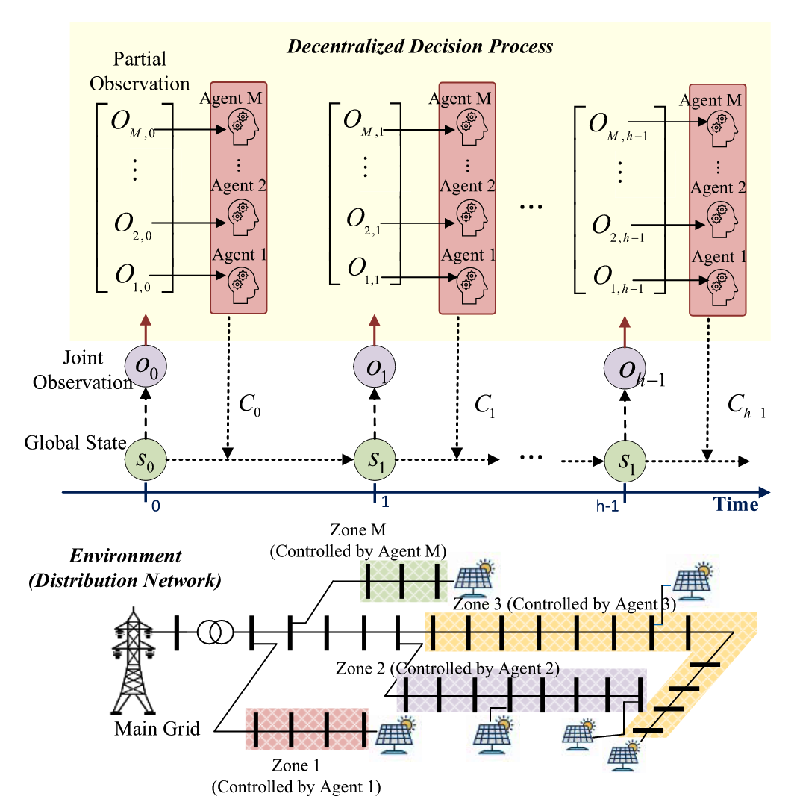
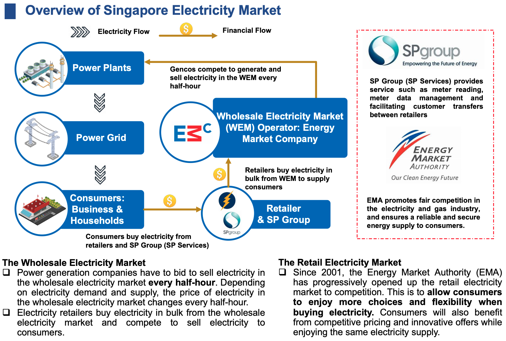
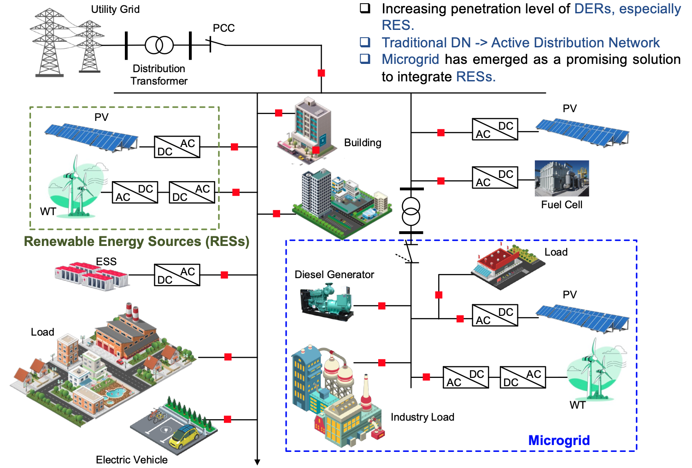

<h3 style="background-color:#f0f8ff; padding:20px; border-radius:15px; text-align:center;">
  Data-Driven Voltage/Var Control in Distribution Network
</h3>

Traditional Voltage/Var Control (VVC) algorithms are generally model-based and require accurate system models and parameters, which can be difficult and costly to obtain and maintain. Furthermore, the classic optimization algorithms may suffer from modeling restrictions, slow computation speed, or convergency difficulty. As an alternative, deep reinforcement learning (DRL) based data-driven methods have shown stronger capability in real-time control.

**Selected Publications:**
* **R. Yan** and Y. Xu, “Multi-objective and multi-agent deep reinforcement learning for real-time decentralized volt/var
control of distribution networks considering pv inverter lifetime,” *IEEE Transactions on Power Systems*, 2024.
* **R. Yan**, Q. Xing, and Y. Xu, “Multi agent safe graph reinforcement learning for pv inverters based real-time
decentralized volt/var control in zoned distribution networks,” *IEEE Transactions on Smart Grid*, 2023.

<h3 style="background-color:#f0f8ff; padding:20px; border-radius:15px; text-align:center;">
  Energy Trading and Electricity Market
</h3>

**Selected Publications:**
* **R. Yan** and Y. Xu, “A data-driven method for microgrid bidding optimization in electricity market,” *IET Energy
Conversion and Economics - Wilely Online Library*, 2023.

<h3 style="background-color:#f0f8ff; padding:20px; border-radius:15px; text-align:center;">
  Microgrid Operation & Control
</h3>

**Selected Publications:**
* **R. Yan**, Y. Xu, and R. Zhang, “A graph attention network based reinforcement learning method for optimal distributed
frequency control of an islanded ac microgrid,” in 2023 IEEE Power & Energy Society General Meeting (PESGM), 2023
* **R. Yan**, Y. Wang, Y. Xu, and J. Dai, “A multiagent quantum deep reinforcement learning method for distributed
frequency control of islanded microgrids,” IEEE Transactions on Control of Network Systems, vol. 9, no. 4, pp. 1622–1632,
2022.
* **R. Yan**, Y. Wang, J. Dai, Y. Xu, and A. Q. Liu, “Quantum-key-distribution-based microgrid control for cybersecurity
enhancement,” IEEE Transactions on Industry Applications, vol. 58, no. 3, pp. 3076–3086, 2022.  doi:
10.1109/TIA.2022.3159314.
* **R. Yan**, Y. Wang, J. Dai, Y. Xu, and A. Q. Liu, “Quantum-key-distribution-based microgrid control for cybersecurity
enhancement (conference),” in 2021 IEEE Industry Applications Society Annual Meeting (IAS), 2022.

